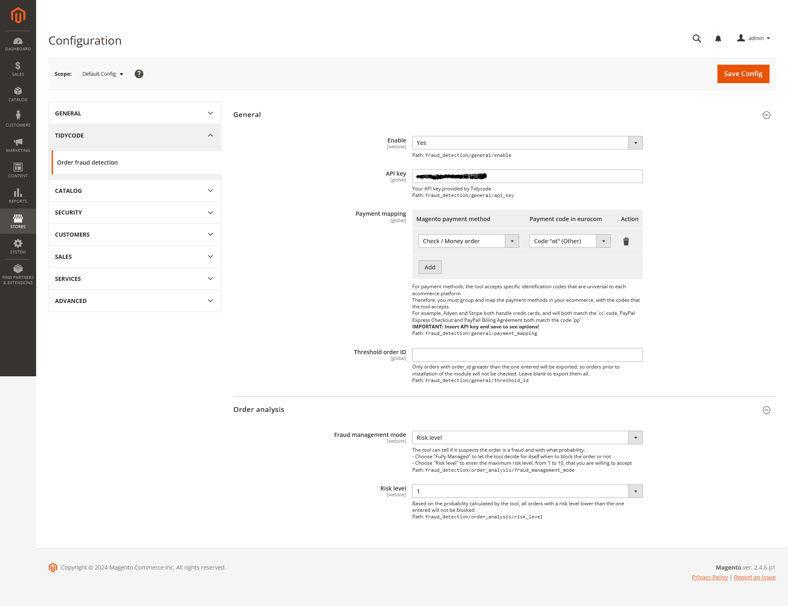
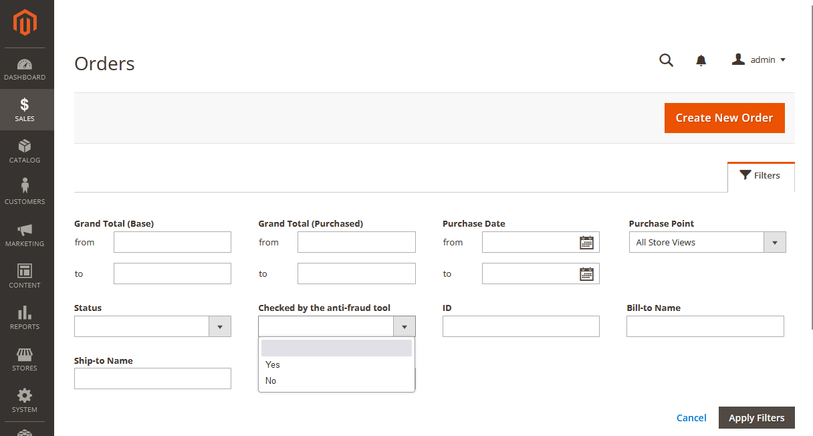
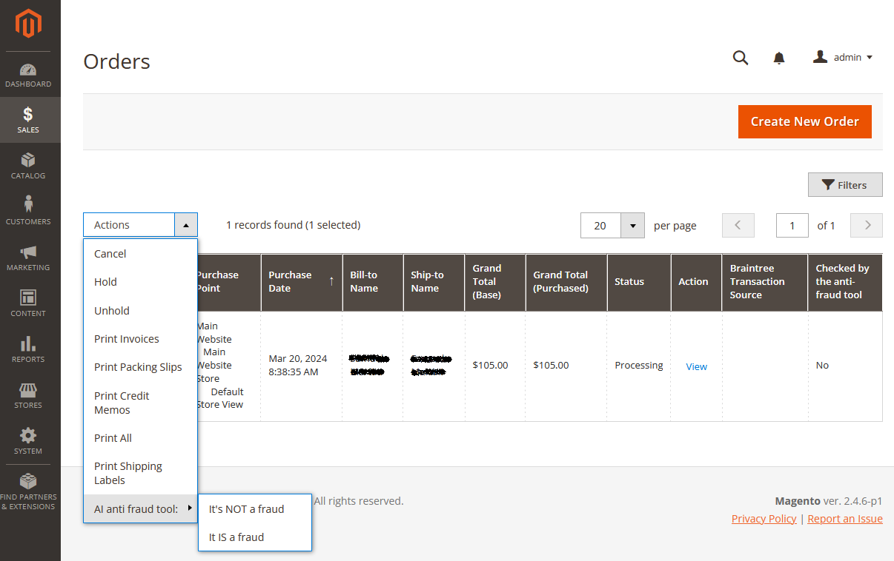
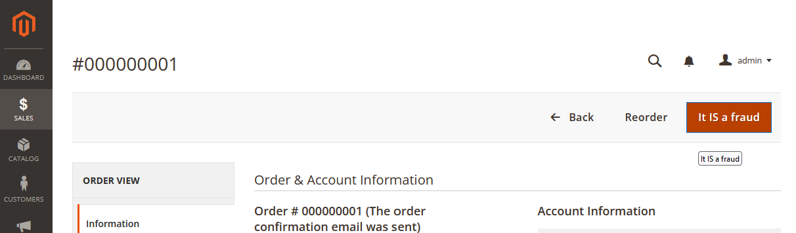
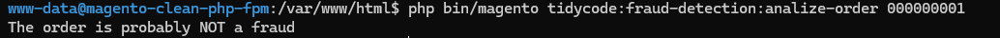

# Tidycode AI Fraud Detection Module

## Overview

The Tidycode AI Fraud Detection module for Magento is designed to integrate the Tidycode AI-powered service to monitor and detect fraudulent orders in an eCommerce store. This module allows you to automatically analyze orders and mark those suspected of fraud based on intelligent algorithms. The analysis is configurable at the website level, and the module provides various settings to fine-tune the fraud detection process.

## Installation

Install the module via Composer with the following command:

```bash
composer require tidycode/magento2-ai-fraud-detection
```

After installation, run the Magento setup upgrade and di compile commands:

```bash
bin/magento module:enable Tidycode_AIFraudDetection
bin/magento setup:upgrade
bin/magento setup:di:compile
```

## Configuration

The module's settings can be accessed from the Magento admin panel under **Tidycode -> Order Fraud Detection**. The configuration is divided into two main sections: **General** and **Order Analysis**.

### General Settings

- **Enabled:** (Yes/No) Enable or disable the fraud detection functionality. This is configurable per website, so only orders from enabled websites will be analyzed.
- **API Key:** The API key provided by Tidycode for authentication with the fraud detection tool. This is required to use the service.
- **Payment Mapping:** Map the payment methods used in Magento to those recognized by the Tidycode fraud detection tool. Since different eCommerce platforms may have different payment codes, this mapping ensures compatibility.
- **Threshold Order ID:** Specify the last order ID processed before the module was installed. Orders before this ID will be skipped, reducing the workload for the AI tool.

### Order Analysis Settings

- **Fraud Management Mode:** The fraud detection tool can evaluate orders based on the following modes:
    - **Fully Managed:** Let the tool autonomously decide which orders to block based on its risk assessment.
    - **Risk Level:** Set a maximum risk level (from 1 to 10) that you are willing to accept. Orders with a higher risk level than specified will be blocked.
- **Risk Level:** When the module is in "Risk Level" mode, orders with a risk level below this threshold will not be blocked, while those above it will be.



## Functionality

- The module automatically checks orders every minute, querying the fraud detection tool and deciding which orders to mark as suspicious. It flags checked orders to skip them in future analyses.
- A column in the order grid of the backoffice indicates whether an order has already been checked. This column can be hidden and filtered.
- If the AI marks a legitimate order as fraud or misses a fraudulent order, users can report these errors via the backoffice. This feedback helps continuously retrain the AI, improving its accuracy over time. Reports can be made in bulk from the order grid or individually from the order detail page. Reporting an error will also correct the order's status in Magento.

  

## CLI Command

The module provides a command-line tool for testing and investigating orders:

```bash
bin/magento tidycode:fraud-detection:analize-order <order-number>
```

This command submits the specified order to the fraud detection tool to determine if it is suspicious. Note that this is for investigation only and does not alter the order's status.



## Support

For support or further information, please contact [Tidycode Support](https://www.tidycode.it).

---

# Modulo Tidycode AI Fraud Detection

## Panoramica

Il modulo Tidycode AI Fraud Detection per Magento è progettato per integrare il servizio Tidycode basato su intelligenza artificiale per monitorare e rilevare ordini fraudolenti in un negozio eCommerce. Questo modulo consente di analizzare automaticamente gli ordini e contrassegnare quelli sospettati di frode in base a algoritmi intelligenti. L'analisi è configurabile a livello di sito web, e il modulo fornisce varie impostazioni per ottimizzare il processo di rilevamento delle frodi.

## Installazione

Installa il modulo tramite Composer con il seguente comando:

```bash
composer require tidycode/magento2-ai-fraud-detection
```

Dopo l'installazione, esegui i comandi di aggiornamento di Magento:

```bash
bin/magento module:enable Tidycode_AIFraudDetection
bin/magento setup:upgrade
bin/magento setup:di:compile
```

## Configurazione

Le impostazioni del modulo sono accessibili dal pannello di amministrazione di Magento sotto **Tidycode -> Order Fraud Detection**. La configurazione è suddivisa in due sezioni principali: **Generale** e **Analisi Ordini**.

### Impostazioni Generali

- **Abilitato:** (Sì/No) Abilita o disabilita la funzionalità di rilevamento delle frodi. Questa configurazione è per sito web, quindi solo gli ordini dei siti abilitati verranno analizzati.
- **API Key:** La chiave API fornita da Tidycode per autenticarsi con il tool anti frode. Questa è necessaria per utilizzare il servizio.
- **Mapping dei Metodi di Pagamento:** Mappa i metodi di pagamento utilizzati in Magento con quelli riconosciuti dal tool di rilevamento frodi di Tidycode. Poiché le diverse piattaforme eCommerce possono avere codici di pagamento differenti, questa mappatura assicura la compatibilità.
- **Threshold Order ID:** Specifica l'ID dell'ultimo ordine processato prima dell'installazione del modulo. Gli ordini precedenti a questo ID verranno saltati, riducendo il carico di lavoro per il tool AI.

### Impostazioni di Analisi degli Ordini

- **Modalità di Gestione delle Frodi:** Il tool anti frode può valutare gli ordini in base alle seguenti modalità:
    - **Completamente Gestito:** Lascia che lo strumento decida autonomamente quali ordini bloccare in base alla valutazione del rischio.
    - **Livello di Rischio:** Imposta un livello di rischio massimo (da 1 a 10) che sei disposto ad accettare. Gli ordini con un livello di rischio superiore a quello specificato verranno bloccati.
- **Livello di Rischio:** Quando il modulo è in modalità "Livello di Rischio", gli ordini con un livello di rischio inferiore alla soglia non verranno bloccati, mentre quelli superiori sì.


## Funzionalità

- Il modulo controlla automaticamente gli ordini ogni minuto, interrogando il tool anti frode e decidendo quali ordini contrassegnare come sospetti. Contrassegna gli ordini già controllati per saltarli nelle analisi successive.
- Una colonna nella griglia degli ordini del backoffice indica se un ordine è già stato controllato. Questa colonna può essere nascosta e filtrata.
- Se l'AI contrassegna un ordine legittimo come frode o lascia passare un ordine fraudolento, gli utenti possono segnalare questi errori dal backoffice. Questo feedback aiuta a riaddestrare continuamente l'AI, migliorando la sua accuratezza nel tempo. Le segnalazioni possono essere fatte in massa dalla griglia degli ordini o singolarmente dalla scheda di dettaglio dell'ordine. Segnalare un errore correggerà anche lo stato dell'ordine in Magento.

  

## Comando CLI

Il modulo fornisce uno strumento a riga di comando per testare e indagare sugli ordini:

```bash
bin/magento tidycode:fraud-detection:analize-order <order-number>
```

Questo comando invia l'ordine specificato al tool anti frode per determinare se è sospetto. Nota che questo è solo per scopi investigativi e non altera lo stato dell'ordine.


## Supporto

Per supporto o ulteriori informazioni, contatta il [supporto di Tidycode](https://www.tidycode.it).
